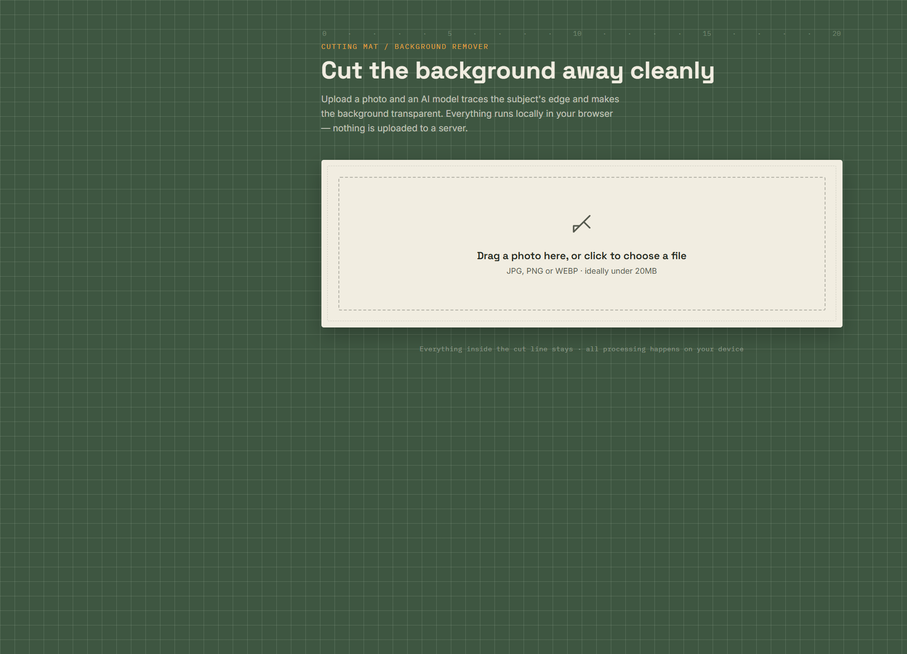
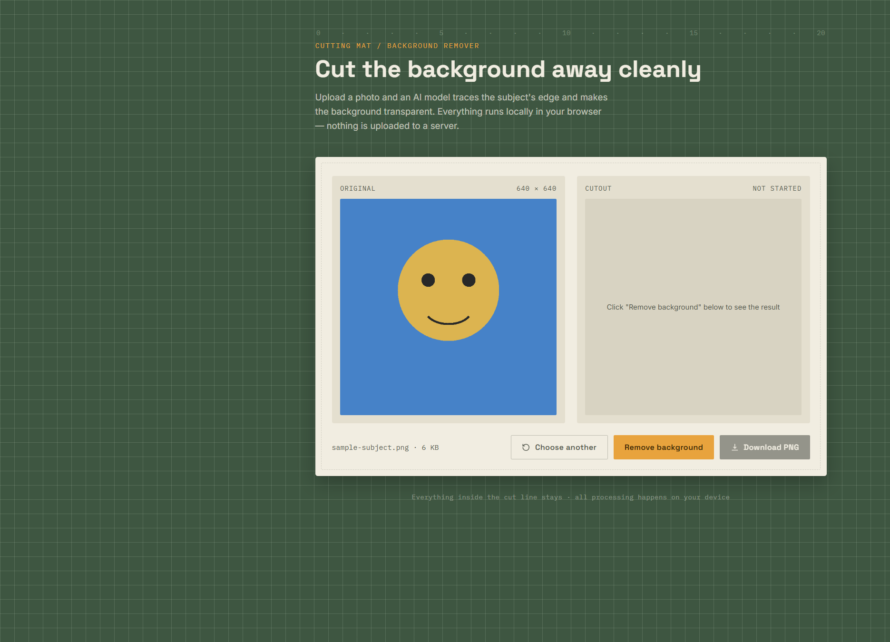
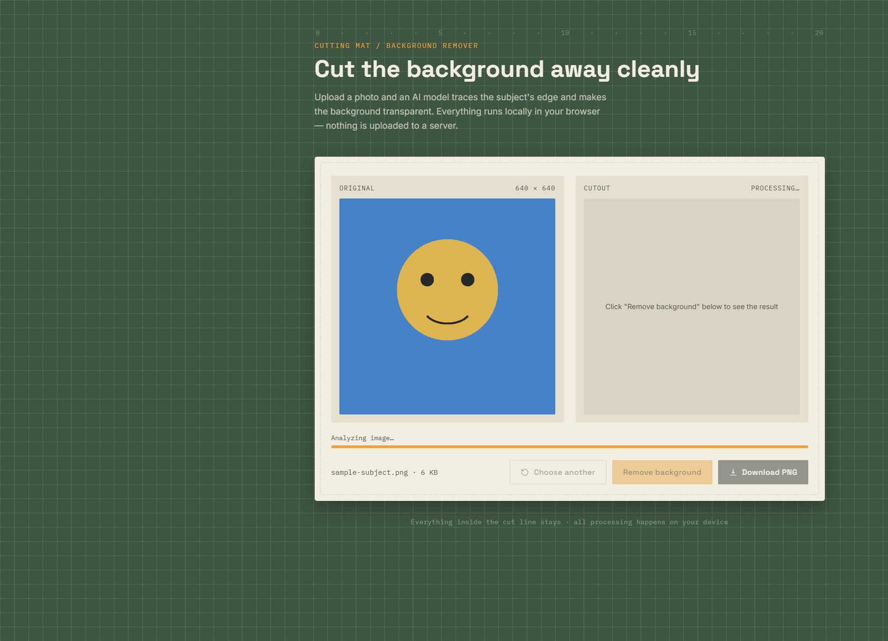
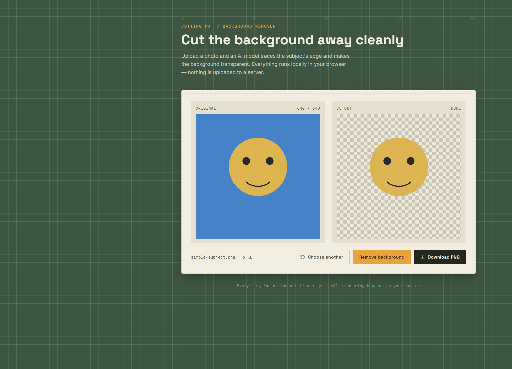

# Cutting Mat · Background Remover

浏览器端 AI 抠图工具：上传照片后，本地模型会描出主体轮廓并把背景变成透明 PNG。  
**图片不会上传到服务器**，全部在你的浏览器里完成。



## 功能简介

- 拖拽或点击上传 JPG / PNG / WEBP
- 浏览器本地运行 `@huggingface/transformers` + `briaai/RMBG-1.4` 模型
- 左右对照：Original（原图）与 Cutout（透明背景结果）
- 一键下载透明 PNG

## 快速开始

### 方式一：本地 XAMPP / 任意静态服务器

1. 把本仓库放到 Web 根目录（例如 `C:\xampp\htdocs\remove-background`）
2. 启动 Apache（或任意能提供静态文件的服务）
3. 浏览器打开：

```text
http://localhost/remove-background/
```

### 方式二：直接打开文件

用 Chrome / Edge / Firefox 直接打开 `index.php`（本页无 PHP 逻辑，当作 HTML 即可）。  
首次去背景需要联网下载模型文件（cdn.jsdelivr.net、huggingface.co）。

> 建议不要用受限的内嵌预览面板打开；用普通浏览器标签页效果最好。

## 使用手册（User Manual）

### 1. 打开页面

进入应用后会看到裁切垫风格的首页，中间是上传区域。


### 2. 上传照片

- **拖拽**图片到虚线框，或  
- **点击**虚线框，从文件选择器里选一张图  

支持：JPG、PNG、WEBP（建议小于 20MB）。

上传成功后进入工作区：左侧 **Original**，右侧 **Cutout**（尚未处理）。



### 3. 去除背景

点击橙色按钮 **Remove background**。

- 第一次运行会下载 AI 模型（进度条显示 Downloading model files…）
- 随后进入 Analyzing image…
- 右侧状态变为 **Processing…**



### 4. 查看结果并下载

处理完成后：

- 右侧状态显示 **Done**
- Cutout 区域以棋盘格表示透明背景
- **Download PNG** 变为可用，点击即可保存 `原文件名-cutout.png`



### 5. 换一张图

点击 **Choose another** 回到上传区，重新选择照片。

## 界面按钮说明

| 按钮 | 作用 |
|------|------|
| Choose another | 清空当前图，重新选择 |
| Remove background | 开始本地 AI 抠图 |
| Download PNG | 下载透明背景 PNG（需先处理成功） |

## 技术说明

| 项目 | 说明 |
|------|------|
| 前端 | 单文件 `index.php`（纯 HTML/CSS/JS） |
| AI | Hugging Face Transformers.js `background-removal` |
| 模型 | `briaai/RMBG-1.4`（fp32） |
| 隐私 | 原图与结果均在本地处理，不经本仓库后端上传 |

## 注意事项

1. **首次使用需联网**下载模型，之后浏览器缓存可加快再次使用。
2. 复杂背景、细发丝、半透明物体效果可能因图而异。
3. 大图会更慢；若失败，可换一张图或刷新页面重试。
4. 需能访问 `cdn.jsdelivr.net` 与 `huggingface.co`。

## 仓库结构

```text
remove-background/
├── index.php                 # 应用本体
├── README.md                 # 本使用手册
└── docs/screenshots/         # README 截图
    ├── 01-home.png
    ├── 02-workspace.png
    ├── 03-processing.png
    └── 04-result.png
```

## License

MIT（可按需自行更换）
